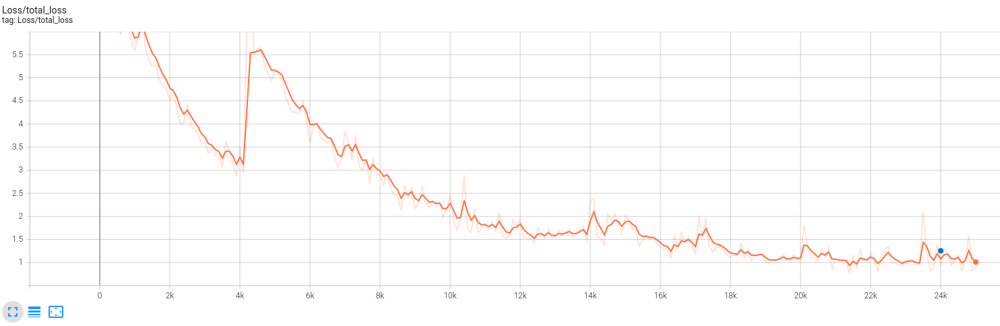
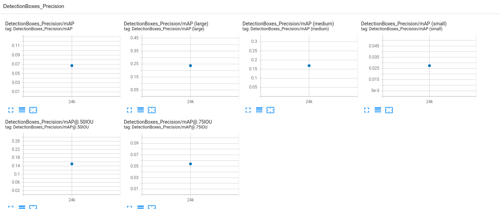
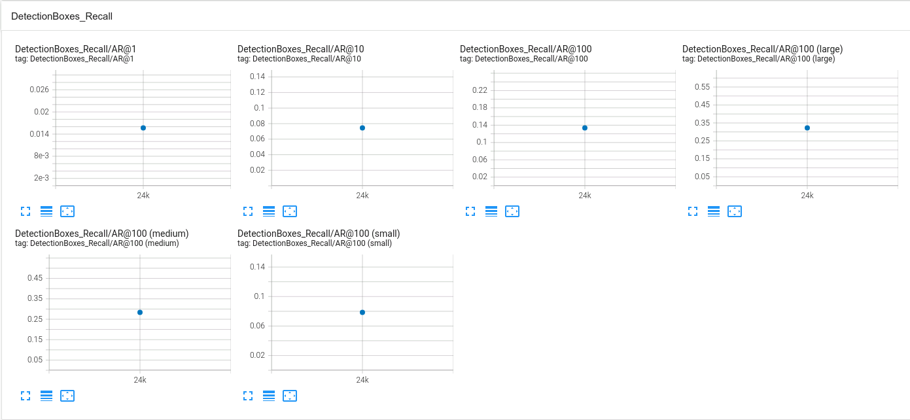
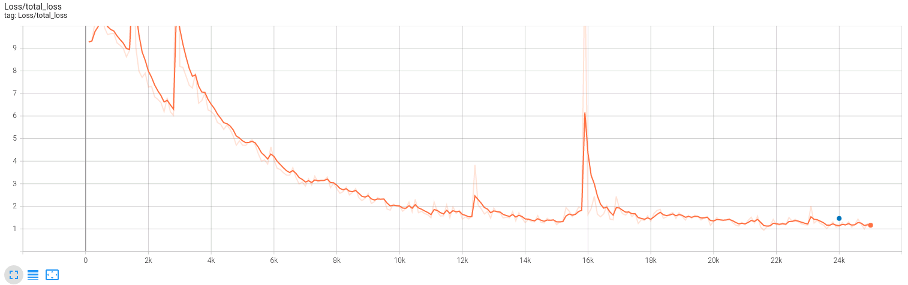
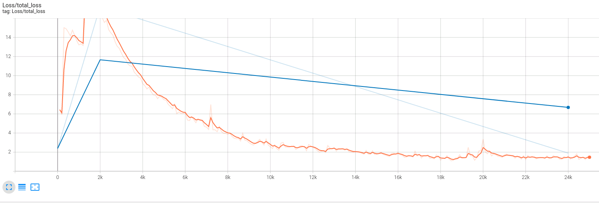
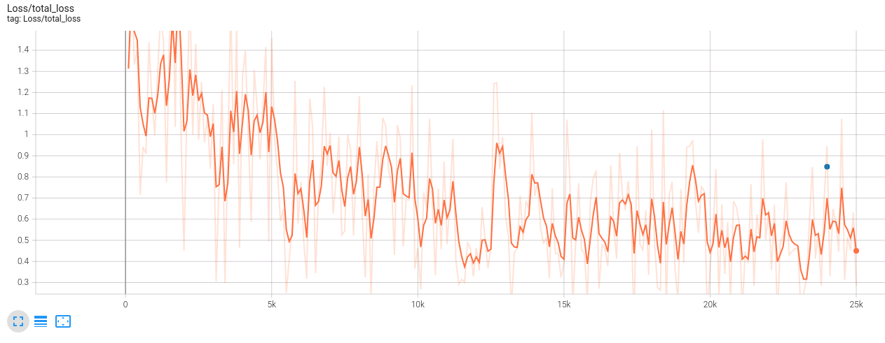
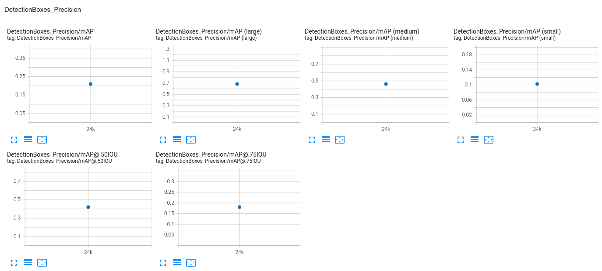
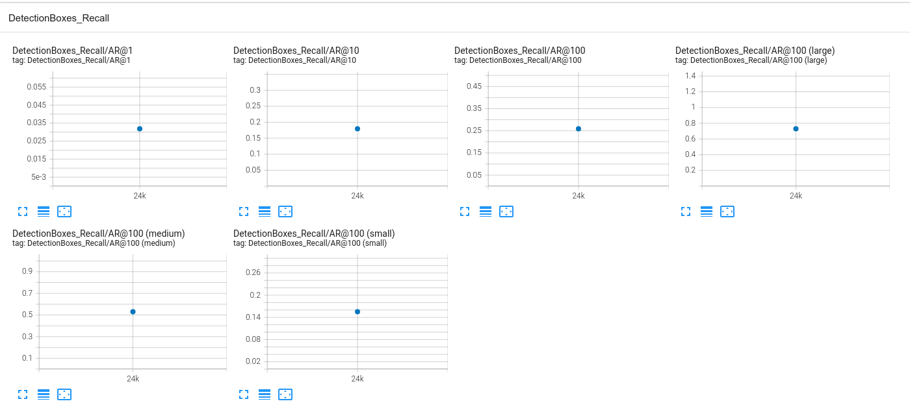

# Object Detection in an Urban Environment

This project uses [Waymo Open dataset](https://waymo.com/open/) and [TF Object Detection API](https://github.com/tensorflow/models/tree/master/research/object_detection) to detect objects in urban environment.

It requires re-training of existing models provided by the TF Object Detection API to recognize vehicles, pedestrians and cyclists.

## Building/Installation
The basic dependencies are in [environment.yml](environment.yml) that can be installed using:

    conda env create -f environment.yml

Installation of the TF Object Detection API is more complex and it is described [here](https://tensorflow-object-detection-api-tutorial.readthedocs.io/en/latest/install.html). I used Python 3.8 and TF 2.8.

Waymo dataset also needs to be installed manually because it "depends" on TF2.6:

    pip install --no-deps waymo-open-dataset-tf-2-6-0

## Data Download
This requires access to the [Waymo Open dataset](https://waymo.com/open/) which takes about a month to approve.
Once approved, use the [download_process.py](download_process.py) to download the data:

    mkdir data
    python download_process.py --data_dir data [--size {number of files you want to download}]

It takes about 3 hours to complete.

Preliminary analysis of the dataset is in [Exploratory Data Analysis.ipynb](Exploratory Data Analysis.ipynb)

### Cross-Validation Strategy
To detect potential overfitting issues, the network performance needs to be validated on data unseen during training. 
This is done by splitting the dataset into 3 groups - training, validation and test dataset - and using each only for the one specific function.
This way, if the training overfits on the training dataset (showing high accuracy), the results on validation dataset would show low accuracy. 

Once downloaded, the data needs to be split into 3 groups: (i) training (70%), (ii) validation (20%) and (iii) test (10%).
This can be done using [create_splites.py](create_splits.py):

    mkdir data/train data/val data/test
    python create_splits.py --source data/processed --destination data

[create_splits.py](create_splits.py) uses `np.random.choice` to randomly select the files that are than symlinked to the target directories.
Because the instructions require animation to be created using a specific file, this file needs to be manually swapped with one of the files in the test dir.
The file is `./data/test/segment-12200383401366682847_2552_140_2572_140_with_camera_labels.tfrecord`
Find the file and move it to the test dir and move one of the test files to the dir. The file may already be in the test dir in which case nothing needs to be done.

    find . -name segment-122*

    # if the result is something like:
    # ./data/train/segment-12200383401366682847_2552_140_2572_140_with_camera_labels.tfrecord
    # ./data/processed/segment-12200383401366682847_2552_140_2572_140_with_camera_labels.tfrecord
    
    mv data/train/segment-12200383401366682847_2552_140_2572_140_with_camera_labels.tfrecord data/train/
    # and move one of the files in data/test to data/train

## Training
The models from the [TF Object Detection Model Zoo](https://github.com/tensorflow/models/blob/master/research/object_detection/g3doc/tf2_detection_zoo.md) are pre-trained on the [COCO 2017 dataset](http://cocodataset.org/),
however, we need them to work with the Waymo dataset and custom classes (vehicle, pedestrian, and cyclist).
To do that, the classifier needs to be re-trained on our dataset.
The training process is [described here](https://tensorflow-object-detection-api-tutorial.readthedocs.io/en/latest/training.html#configuring-a-training-job) and consists of 3 steps:

1) Download a pre-trained model
2) Configure the training pipeline
3) Run the training and validation

### Pre-trained Models
I tested 3 pre-trained models:

1) [SSD MobileNet V1 FPN 640x640](http://download.tensorflow.org/models/object_detection/tf2/20200711/ssd_mobilenet_v1_fpn_640x640_coco17_tpu-8.tar.gz) (reference model used by the instructions)
2) [SSD ResNet152 V1 FPN 640x640 (RetinaNet152)](http://download.tensorflow.org/models/object_detection/tf2/20200711/ssd_resnet152_v1_fpn_640x640_coco17_tpu-8.tar.gz) (still SSD but larger backbone)
3) [Faster R-CNN Inception ResNet V2 640x640](http://download.tensorflow.org/models/object_detection/tf2/20200711/faster_rcnn_inception_resnet_v2_640x640_coco17_tpu-8.tar.gz) (two stage detector with inception based ResNet V2 representing the next generation of the ResNet based features extractors)

The models are downloaded and un-tarred in `experiments/pretrained_model` dir.

### Pipeline Config
Each pre-trained model comes with its specific pipeline.conf configuration file.
The initial updates of this config file can be done using [edit_config.py](edit_config.py). This will update files locations and some other basic configurations.
I updated this file to accept a source and output file location to make it easier when working with the downloaded pre-trained models.
I also added updates to some parameters like `fine_tune_checkpoint_type`, `num_steps`, etc.

E.g. to pre-process the config for `faster_rcnn_inception_resnet_v2_640x640_coco17_tpu` run the following:

    python edit_config.py --train_dir data/train/ \
        --eval_dir data/val/ \
        --batch_size 2  \
        --checkpoint experiments/pretrained_model/faster_rcnn_inception_resnet_v2_640x640_coco17_tpu-8/checkpoint/ckpt-0 \
        --label_map experiments/label_map.pbtxt \
        --input_file experiments/pretrained_model/faster_rcnn_inception_resnet_v2_640x640_coco17_tpu-8/pipeline.config \
        --output_dir experiments/with_aug_faster_rcnn_inception

There are a few more manual updates needed - [this page](https://github.com/tensorflow/models/blob/master/research/object_detection/g3doc/configuring_jobs.md) describes the config file in more detail:

- `num_classes` in `model.faster_rcnn` (or `model.ssd`) needs to be set to 3
- `learning_rate` in `training_config.optimizer.momentum_optimizer` needs to be updated (I experimented with several settings here but at the end I got the best results with the defaults from SSD config).
- `data_augmentation_options` in `training_config` need to be set

#### Data Augmentations
Data augmentations introduce additional variability to the data without collecting more samples by simply augmenting the existing samples.
Common augmentations include horizontal/vertical flip, zoom in/out, crop, shear, adjustments to brightness, noise, rotations, etc.
They are explored in [Explore Augmentations](Explore%20augmentations.ipynb).

While the augmentations typically improve the final model accuracy, they also slow down the training (additional time is needed augment the images) and using too many augmentations may require more training steps.

The reference pipeline.conf was using the following augmentations:

- `random_horizontal_flip` - needed because the tracked objects may appear on either side of the image
- `random_crop_image` - needed because the tracked objects may be only partially visible (e.g. when occluded by other objects, or being too near the camera)

I tried to improve the performance of the SSD based models by adding the following augmentations:

- `random_image_scale` - because the self-driving car is in motion and the objects need to be detected at various scales depending on how far they are
- `random_adjust_brightness` - because different weather conditions and time of day will produce images of different brightness
- `random_adjust_contrast` - because the camera on a moving vehicle will produce images of varying contrast and sharpness

When experimenting with feature extractor based on FasterRCNN_Inception_ResNet_V2, I used the following augmentations:

- `random_horizontal_flip`
- `random_crop_image` (using settings from the reference config)
- `random_adjust_hue` - controlling 'shade of the color' in the image - needed to simulate different optical conditions of the camera
- `random_adjust_saturation` - controlling amount of 'color' in the image - also needed to simulate different optical conditions of the camera
- `random_adjust_contrast`

#### Running the Training
The training can be run using this command:

    python experiments/model_main_tf2.py --model_dir=experiments/with_augs_faster_rcnn_inception/ --pipeline_config_path=experiments/with_augs_faster_rcnn_inception/pipeline.config

The validation is run using:

    python experiments/model_main_tf2.py --model_dir=experiments/with_augs_faster_rcnn_inception/ --pipeline_config_path=experiments/with_augs_faster_rcnn_inception/pipeline.config --checkpoint_dir=experiments/with_augs_faster_rcnn_inception/

## Results
The following charts show the default reference model:

Reference model on test dataset:

Although, the augmentations added to the SSD based models helped to smooth out the training curve a little, they did not help with the inference on the test dataset.
In fact, the SSD_resnet50 (same as reference model) recognized a wheel as a vehicle and didn't recognize vehicles but SSD_resnet152 didn't recognize anything.

SSD with Resnet152 and augmentations ended up with higher total loss than ResNet50 which is a little surprising. It also achieved the worst results on the test dataset - it didn't recognize anything.

In case of FasterRCNN_Inception_ResNet_V2, using the augmentations in combination with a better feature extractor achieved much lower `total_loss` of ~0.5 (the TF object detector reference recommends total_loss of <= 1 but not too close to 0 for good results) and final validation `total_loss` of 0.84.

Faster RCNN on test dataset:

